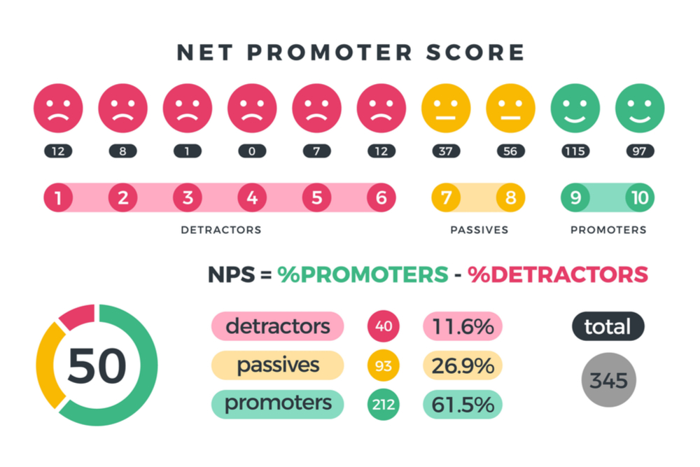

# NET PROMOTER SCORE - ROCKESEAT(#NLW04) 

Net Promoter or Net Promoter Score is the percentage of customers rating their likelihood to recommend a company, a product, or a service to a friend or colleague as 9 or 10 minus the percentage rating this at 6 or below on a scale from 0 to 10

